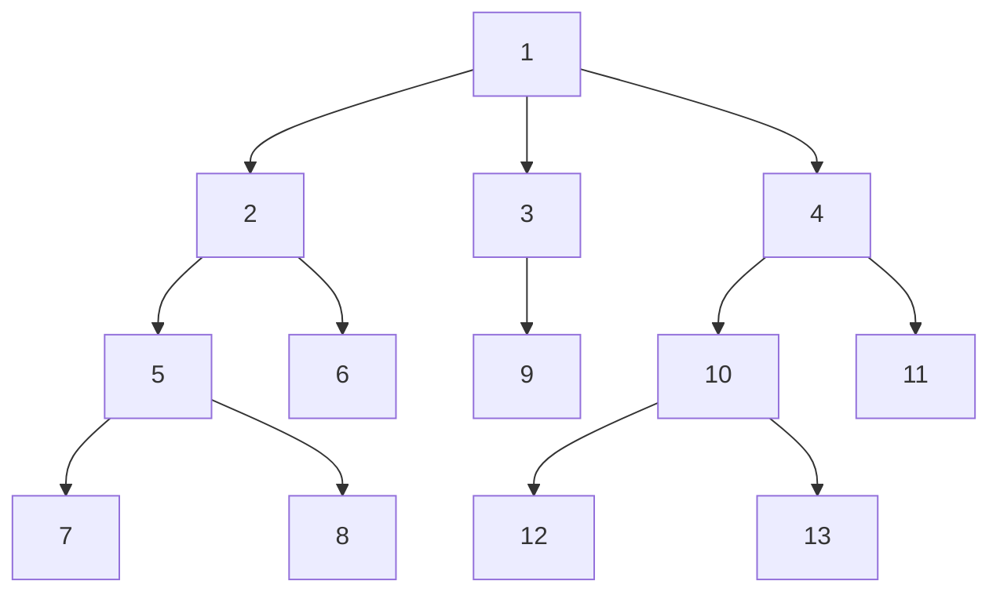

# Depth-First search and Breadth-First Search Algorithms

In this repository, you will find implementations of Depth-First Search (DFS) and Breadth-First Search (BFS) algorithms using the Python programming language.

Visualization of the graph that is used in the code.

